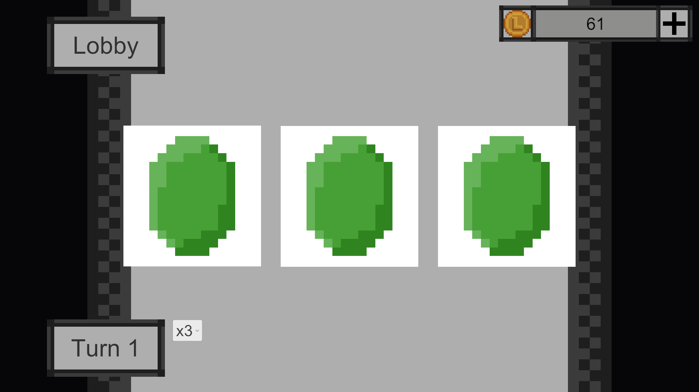
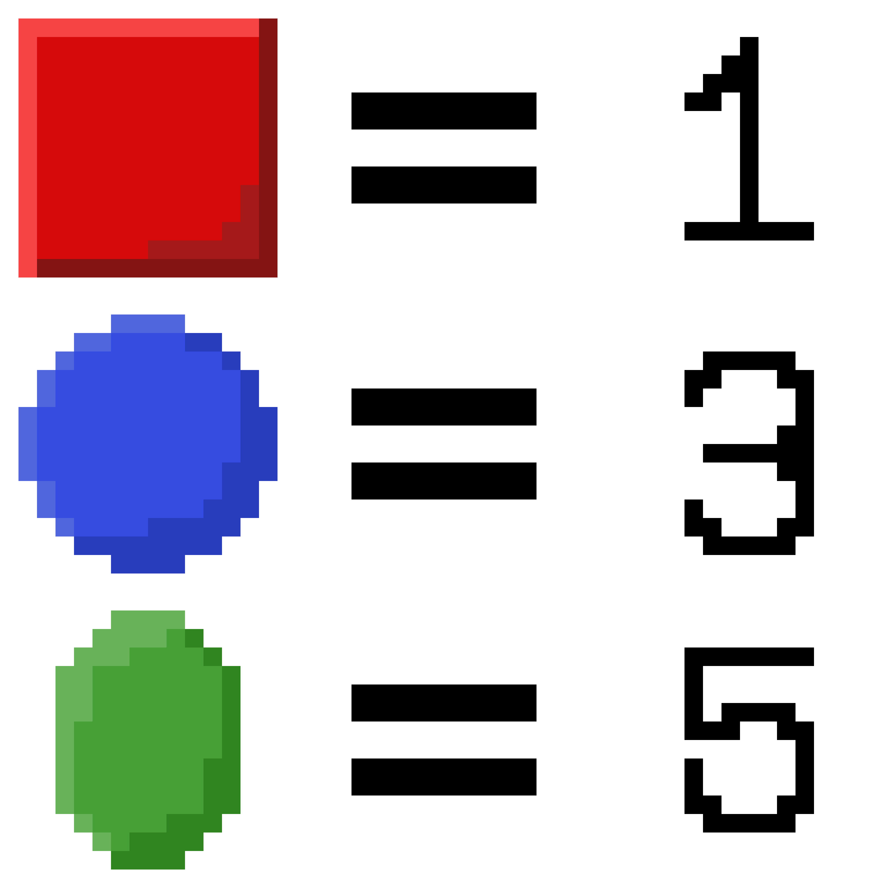

# La-Spin

**A mini game based on a slot machine**

*this is my side project btw*

***Current version: 1.1***

---

see the [Change Log](ChangeLog.md) if you want~

# How to Play
<ins><b>There is no goal in this game, so just have fun!</b></ins> 
or i might be add it one... i guess?

This slot machine is very simple: one row with up to five columns.

Something like this:  

Hit "Turn" to spin and get some L Coin~!

> [!IMPORTANT]
> We do not encourage you to indulge in gambling!

Full Game Estimated Time:  
15m (with 100% Achievement)

# System Requirements

- OS: Windows 10 or later (might work on older versions too) [x64]
- CPU: Any modern processor  
- RAM: 4 GB or more
- GPU: Any GPU that supports basic 2D graphics  
- Storage: 200 MB free (game size ~124 MB)  

# How It Works

In La-Spin, you have one row and up to five columns.  
Columns can be 1, 2, … up to 5.

## Paying L Coin
When you hit "Play", you need to pay the **base coin**, which depends on how many columns you have:  
- Example: 1 column = 1 L Coin, 3 columns = 3 L Coin  

You can also add a **Magnification** multiplier (up to x5 on a 5-column slot).  
So the total cost is:

Total = base coin * column count * Magnification

> [!NOTE]
> Normally, base coin is always 1.

## Getting L Coin
When the slot spins, you will randomly get one of these shapes:

- **Red Square** → 1 L Coin  
- **Blue Circle** → 3 L Coin  
- **Green Emerald** → 5 L Coin  

---

### Calculation Rules

**1 column slot:**  

p x n

> [!NOTE]
> p = slot shape value; n = Magnification

**2 columns or more:**  

- **No same shape:** 
(p1 + p2 + … + pi) x n

- **Same shape:** 
(p x [i x 2]) x n

- **Exception for Red Square (balance buff):** 
(p x [i x 5]) x n

> [!NOTE]
> p = shape value; i = number of matching columns; n = Magnification

# Probability

> [!NOTE]
> actually is split equally, so it's like 33.333333333333333333333333333333333333333333333333333333333333...% for every shape

# Plans for Future Updates (Update v1.1.0)

1. More Achievement
2. More Music
3. More Memes.............?

# Achievement

> [!NOTE]
> These are just a plan, the full achievement will be updated in v1.2.0

Before v1.2.0, by just going [here](Achievement.md)

Nothing. Lalapinkbun just lazy lol  
-Fenqiyuan

# Credit

---- Trio Dimension ----

Idea by Lalapinkbun  
Coding by Lalapinkbun  
Music by Lalapinkbun  
Art by Lalapinkbun

# More
Lalapinkbun

- [Lalapinkbun Discord Server](https://discord.gg/EFTQ4sb7YD)
- [Lalapinkbun Youtube Channel](https://www.youtube.com/@lalapinkbun)

Trio Dimension

- [Trio Dimension Youtube Channle](https://www.youtube.com/@TrioDimensionStudioOfficial)
